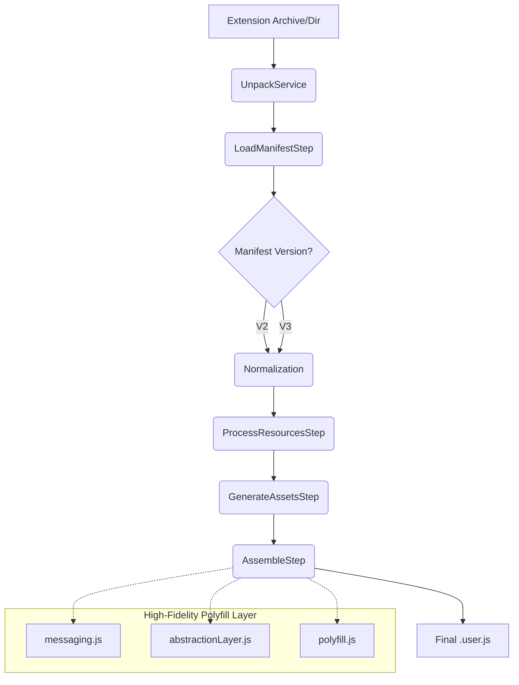

# 🚀 to-userscript

## The Ultimate WebExtension Transcendence Layer

[](https://github.com/johnlikescarrot/to-userscript)
[](https://github.com/johnlikescarrot/to-userscript)
[](https://github.com/johnlikescarrot/to-userscript)
[](https://opensource.org/licenses/ISC)

**"Transcend the Browser."** Convert any Chrome or Firefox extension into a high-performance, portable Userscript with a single command.

Built with an industrial-grade **Migration Engine**, `to-userscript` is strictly typed, 100% tested, and ready for professional deployment.

[Explore Docs](./docs/architecture.md) • [Report Bug](https://github.com/johnlikescarrot/to-userscript/issues) • [Request Feature](https://github.com/johnlikescarrot/to-userscript/issues)

---

## 🌟 Why to-userscript?

Most converters are fragile scripts. `to-userscript` is a **robust transformation framework**.

- **🛡️ Strictly Typed**: Powered by TypeScript and Zod for absolute manifest integrity.
- **⚙️ Step-Based Engine**: Atomic conversion lifecycle (Unpack → Parse → Process → Inline → Assemble).
- **📦 Zero External Dependencies**: Generates completely self-contained `.user.js` files.
- **🔌 High-Fidelity Polyfill**: Emulates modern Chrome APIs (SidePanel, DNR, Identity, Action) inside a secure isolation layer.
- **🎨 Asset Inlining**: Recursively converts HTML, CSS, and binary images into embedded Data/Blob URLs.

---

## 📊 Capability Matrix

| WebExtension API | Support Level | Implementation Note |
| :--- | :---: | :--- |
| `chrome.storage` | ✅ FULL | Support for `local`, `sync`, and `session` areas. |
| `chrome.runtime` | ✅ FULL | High-fidelity messaging, port connections, and manifest access. |
| `chrome.action` | ✅ FULL | Badge text, icons, and popup management. |
| `chrome.sidePanel`| ✅ FULL | Isolated UI rendered via secure Shadow DOM. |
| `chrome.scripting`| ✅ FULL | Dynamic execution via strict parameter-injection. |
| `chrome.tabs` | 🟡 PARTIAL | Support for `create`, `query`, and `sendMessage`. |
| `chrome.identity` | ✅ FULL | OAuth2 flow support. |
| `chrome.alarms` | ✅ FULL | Persistent interval management. |
| `chrome.i18n` | ✅ FULL | Comprehensive localized messaging. |

---

## 🛠️ Architecture: The Transformation Lifecycle

`to-userscript` operates as a sequential pipeline of atomic transformation steps:



---

## ⚡ Quick Start

### Installation

```bash
# Using bun (recommended)
bun install -g to-userscript

# Using npm
npm install -g to-userscript
```

### Usage

**Convert a local directory:**
```bash
to-userscript convert ./my-extension -o my-script.user.js
```

**Convert from Chrome Web Store:**
```bash
to-userscript convert "https://chromewebstore.google.com/detail/..." -o wikipedia.user.js
```

---

## 🛡️ Security & Isolation

We implement a multi-layered isolation strategy to ensure extension code never conflicts with the host page:

1. **Parameter Injection Architecture**: Scripts are executed inside a `new Function` scope with explicit global overrides (`chrome`, `window`, `self`).
2. **Shadow DOM UI**: Popups and Side Panels are mounted into a **closed** Shadow DOM to prevent CSS leakage from the host page.
3. **Iframe Sandboxing**: Internal UI pages are loaded into restricted `<iframe>` environments with strict `sandbox` attributes.

---

## 🛡️ Troubleshooting (CSP)

Some websites have strict **Content Security Policies** that block Data URLs or Blobs. If your script doesn't work:

1. Open Tampermonkey Dashboard.
2. Go to **Settings** -> **Advanced**.
3. Set **"Modify existing Content Security headers"** to **"Remove entirely"**.

---

## 📜 License

ISC © 2024. Part of the **Ultimate Project** initiative.
