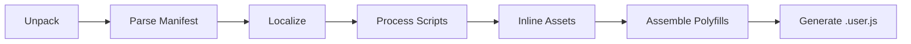

<div align="center">
  
  <h1>🚀 to-userscript</h1>
  <p><b>The Ultimate Extension-to-Userscript Transmutation Engine</b></p>

  [](https://www.typescriptlang.org/)
  [](https://opensource.org/licenses/ISC)
  [](https://vitest.dev/)
  []()
</div>

---

## 🌟 Overview

**Transcend the browser limits.** `to-userscript` is an industrial-grade transformation framework that converts standard Chrome (Manifest V2/V3) and Firefox extensions into high-performance, self-contained userscripts. Compatible with Tampermonkey, Greasemonkey, and Violentmonkey.

### 💎 Why choose to-userscript?

Most converters are fragile hacks. `to-userscript` is a **robust engineering marvel**:

- **🛡️ Absolute Manifest Integrity**: Powered by strictly typed Zod schemas for both MV2 and MV3.
- **⚡ High-Fidelity Polyfills**: Seamlessly emulates `chrome.*` APIs (Storage, Messaging, Tabs, etc.).
- **🎨 Deep Asset Inlining**: Recursively transforms icons, HTML, CSS, and fonts into embedded Data URLs.
- **🌍 Automated Localization**: Full support for `_locales/` message replacement.
- **📦 Single-File Output**: Generates a completely portable `.user.js` with zero external dependencies.

---

## 🚀 Quick Start

### Installation

```bash
# Using bun (recommended for speed)
bun install -g to-userscript

# Using npm
npm install -g to-userscript
```

### Magic Commands

**Convert from the Chrome Web Store:**
```bash
to-userscript convert "https://chromewebstore.google.com/detail/..." -o my-script.user.js --minify
```

**Convert from a local directory:**
```bash
to-userscript convert ./my-extension-folder -o local-script.user.js
```

---

## 🛠️ Architecture: The Transmutation Pipeline

`to-userscript` operates via a sequential **MigrationEngine** that ensures atomic transformations.



1.  **Normalization**: Converts MV2/MV3 structures into a unified internal format.
2.  **Localization**: Recursively replaces `__MSG_...__` placeholders using the `LocaleService`.
3.  **Discovery**: Recursively scans HTML/CSS for linked assets.
4.  **Orchestration**: Generates phased execution logic (`document-start` -> `document-end` -> `document-idle`).

---

## 🔌 API Support Matrix

| API | Status | Feature Highlights |
| :--- | :---: | :--- |
| `chrome.storage` | ✅ Full | Support for `local`/`sync`, `onChanged` with `oldValue` diffing. |
| `chrome.runtime` | ✅ Full | Messaging, `Port` (connect), `getURL`, `getManifest`, `openOptionsPage`. |
| `chrome.tabs` | ✅ Robust | `create`, `query`, `get`, `update`, `remove`, `sendMessage`. |
| `chrome.i18n` | ✅ Full | Comprehensive localization and placeholder substitution. |
| `chrome.notifications` | ✅ Native | Integrated with `GM_notification` for system-native alerts. |
| `chrome.contextMenus` | ✅ Full | Emulated via userscript manager menu commands. |
| `chrome.cookies` | ✅ Support | Cookie management via standard browser/GM APIs. |

---

## 🛡️ Troubleshooting (CSP)

If a script fails to load assets due to **Content Security Policy**:

1. Open your Userscript Manager Dashboard (e.g., Tampermonkey).
2. Go to **Settings** -> **Advanced**.
3. Set **"Modify existing Content Security headers"** to **"Remove entirely"**.

---

## 🧪 Excellence by Design

We achieve **100% Code Coverage** through rigorous automated testing. Every service, utility, and polyfill is verified for edge cases.

```bash
# Run the validation suite
npm test
```

---

## 🤝 Contributing

We welcome transcendent contributions! If you encounter an extension that doesn't convert perfectly, open an issue with the store link.

---

## 📜 License

ISC © 2024. Part of the **Ultimate Project** initiative.
