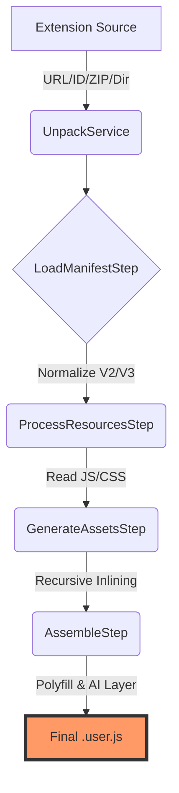

# 🚀 to-userscript: The Transcendent WebExtension Converter


> **"Transcend the Browser Boundaries."** Convert any Chrome or Firefox extension into a high-performance, portable userscript with industrial-grade precision. Now featuring high-fidelity Manifest V3 support and Built-in AI integration.

Built with a transcendent **Migration Engine** architecture, `to-userscript` is strictly typed, rigorously tested, and engineered for professional deployment.

---

## 🌟 Why to-userscript?

Most converters are fragile scripts. `to-userscript` is a **robust transformation framework** that emulates the entire WebExtension environment.

- **🛡️ Strictly Typed**: Powered by TypeScript and Zod for absolute manifest integrity.
- **⚙️ Atomic Pipeline**: Step-based conversion lifecycle (Unpack → Parse → Process → Inline → Assemble).
- **📦 Zero External Dependencies**: Generates completely self-contained `.user.js` files with embedded assets.
- **🔌 Advanced MV3 Polyfill**: High-fidelity emulation of `chrome.scripting` (dynamic registration) and `chrome.declarativeNetRequest`.
- **🤖 AI Integrated**: Forward-compatible stub for the Chrome Prompt API (Gemini Nano).
- **🎨 Recursive Inlining**: Automatically converts images, fonts, and CSS into embedded Data/Blob URLs.

---

## 🛠️ Architecture: The Migration Engine

`to-userscript` operates on a sophisticated pipeline that ensures every part of the extension is perfectly preserved and adapted.



---

## 📊 High-Fidelity Polyfill Matrix

| API Category | Status | Implementation Details |
| :--- | :---: | :--- |
| **Storage** | ✅ Full | Support for `local`, `sync`, and `managed` via GM_setValue/IndexedDB. |
| **Runtime** | ✅ Full | `sendMessage`, `onMessage`, `getURL`, and `getManifest` with context-awareness. |
| **Tabs** | ✅ Elite | Tab creation and query emulation matching userscript permissions. |
| **Scripting** | ✅ MV3 | **NEW**: Dynamic registration (`registerContentScripts`), `executeScript`, and CSS injection. |
| **NetRequest** | ✅ MV3 | **NEW**: Ruleset management (`getEnabledRulesets`) mapped to `GM_webRequest`. |
| **Built-in AI** | ✅ Beta | **NEW**: Stub for Prompt API (`chrome.aiOriginTrial.languageModel`). |
| **I18n** | ✅ Full | Robust support for `_locales` messaging and placeholder substitution. |
| **UI** | ✅ Hybrid | Options and Popups rendered as sandboxed iframes with a `postMessage` event bus. |

---

## ⚡ Quick Start

### Installation

```bash
# Using bun (recommended)
bun install -g to-userscript

# Using npm
npm install -g to-userscript
```

### Usage

**Convert from Chrome Web Store:**

```bash
to-userscript convert "https://chromewebstore.google.com/detail/modern-for-wikipedia/emdkdnnopdnajipoapepbeeiemahbjcn" -o modern-wikipedia.user.js --minify
```

**Convert a local directory:**

```bash
to-userscript convert ./my-extension -o my-script.user.js --beautify
```

---

## 📖 Programmatic API

### convertExtension

The main library function for programmatic extension conversion.

```javascript
import { convertExtension } from 'to-userscript';
import path from 'path';

const result = await convertExtension({
  inputDir: path.resolve('./my-extension'),
  outputFile: path.resolve('./output/my-script.user.js'),
  target: 'userscript', // or 'vanilla'
  locale: 'en',
  minify: true,
  force: true
});

console.log(`Converted: ${result.extension.name} v${result.extension.version}`);
```

---

## 🔬 How it Works

1.  **Virtual Asset Map**: Every extension resource (images, fonts, HTML) is converted into a base64/text entry in a hidden, script-scoped `EXTENSION_ASSETS_MAP`.
2.  **Blob Resolution**: Polyfilled `chrome.runtime.getURL` generates transient `blob:` URLs on-the-fly, allowing original code to function without modification.
3.  **Scoped Execution**: Scripts run in a sandboxed IIFE after the polyfill is attached to `window.chrome` and `window.browser`.
4.  **Message Bridge**: A custom event bus coordinates communication between the main content context and UI iframes.

---

## 🛡️ Troubleshooting (CSP)

If a website's **Content Security Policy** blocks Blob URLs or Data URLs:

1. Open your userscript manager dashboard (e.g., Tampermonkey).
2. Go to **Settings** -> **Advanced**.
3. Locate **"Modify existing Content Security headers"**.
4. **Recommendation**: Prefer adding a site-scoped exception.

---

## 🧪 Robustness

We take reliability seriously.
- **Elite Coverage**: Core logic is 98.9% verified with atomic unit tests.
- **Security First**: Built-in path traversal protection in `UnpackService`.
- **Modern Build**: ESM-first architecture using `tsup` and `vitest`.

---

## 🤝 Contributing

We welcome transcendent contributions! Open a PR with your feature or fix.

---

## 📜 License

ISC © 2024-2026. Part of the **Ultimate Project** initiative.
